# System Block Diagram

```mermaid
%%{init: {'theme': 'base', 'themeVariables': { 'primaryColor': '#4A90A4', 'primaryTextColor': '#fff', 'primaryBorderColor': '#2C5F6E', 'lineColor': '#5D6D7E', 'secondaryColor': '#F5B041', 'tertiaryColor': '#E8F6F3'}}}%%

flowchart TB
    subgraph Users["👥 Users"]
        direction LR
        Caretaker["🧑‍🏫 Caretaker/Educator"]
        Child["👶 Child/AAC User"]
    end

    subgraph Frontend["Frontend (Render Hosting)"]
        direction TB
        subgraph ReactApp["React Application"]
            UI["UI Components<br/>HTML/CSS/JavaScript"]
            Canvas["Canvas API<br/>VSD Annotation & Drawing"]
            State["State Management<br/>Book & Session Data"]
        end
        Browser["🖥️ Browser"]
    end

    subgraph Backend["Backend (Supabase)"]
        direction TB
        Auth["🔐 Authentication<br/>User Accounts & Sessions"]
        Database["🗄️ PostgreSQL Database<br/>Books, VSDs, Vocabulary"]
        Storage["📁 File Storage<br/>Storybook Images & Audio"]
        Realtime["⚡ Realtime<br/>Session Sync"]
    end

    subgraph External["External Services"]
        TTS["🔊 Text-to-Speech API<br/>Web Speech API / Cloud TTS"]
    end

    Caretaker -->|"Upload books<br/>Create VSDs<br/>Add vocabulary"| Browser
    Child -->|"Read books<br/>Click images<br/>Navigate pages"| Browser

    Browser <-->|"Renders UI"| ReactApp
    UI <--> Canvas
    UI <--> State
    Canvas <--> State

    ReactApp <-->|"REST API<br/>Authentication"| Auth
    ReactApp <-->|"CRUD Operations<br/>Book & VSD Data"| Database
    ReactApp <-->|"Upload/Download<br/>Images & Audio"| Storage
    ReactApp <-->|"Live Updates"| Realtime

    ReactApp <-->|"Voice Synthesis"| TTS

    classDef userStyle fill:#E8F8F5,stroke:#1ABC9C,stroke-width:2px
    classDef frontendStyle fill:#EBF5FB,stroke:#3498DB,stroke-width:2px
    classDef backendStyle fill:#FEF9E7,stroke:#F39C12,stroke-width:2px
    classDef externalStyle fill:#F5EEF8,stroke:#9B59B6,stroke-width:2px

    class Users userStyle
    class Frontend frontendStyle
    class Backend backendStyle
    class External externalStyle
```

---

# Tech Stack Legend

```mermaid
%%{init: {'theme': 'base'}}%%

flowchart LR
    subgraph Legend["📋 Tech Stack"]
        direction TB
        
        subgraph L1["1. Frontend Hosting"]
            R1["☁️ Render"]
            R1D["Where our app lives on the web"]
        end
        
        subgraph L2["2. UI Framework"]
            R2["⚛️ React"]
            R2D["Builds our interactive interface"]
        end
        
        subgraph L3["3. Core Languages"]
            R3["📝 JavaScript / HTML / CSS"]
            R3D["The building blocks of our frontend"]
        end
        
        subgraph L4["4. Drawing Tools"]
            R4["🎨 HTML Canvas API"]
            R4D["Powers the VSD editor and hotspots"]
        end
        
        subgraph L5["5. Backend Platform"]
            R5["⚡ Supabase"]
            R5D["Handles auth, data, and file storage"]
        end
        
        subgraph L6["6. Database"]
            R6["🐘 PostgreSQL"]
            R6D["Stores all our app data"]
        end
        
        subgraph L7["7. File Storage"]
            R7["📁 Supabase Storage"]
            R7D["Holds uploaded images and audio"]
        end
        
        subgraph L8["8. Text-to-Speech"]
            R8["🔊 Web Speech API"]
            R8D["Reads words out loud"]
        end
    end

    style L1 fill:#EBF5FB,stroke:#3498DB
    style L2 fill:#EBF5FB,stroke:#3498DB
    style L3 fill:#EBF5FB,stroke:#3498DB
    style L4 fill:#EBF5FB,stroke:#3498DB
    style L5 fill:#FEF9E7,stroke:#F39C12
    style L6 fill:#FEF9E7,stroke:#F39C12
    style L7 fill:#FEF9E7,stroke:#F39C12
    style L8 fill:#F5EEF8,stroke:#9B59B6
```

---

# Component Description

## Frontend

| # | Component | Tech | What it does |
|---|-----------|------|--------------|
| 1 | Hosting | Render | Serves our app to users. We push code, it deploys automatically. |
| 2 | UI Framework | React | Lets us build reusable components like the book library, page viewer, and annotation toolbar. |
| 3 | Languages | JS, HTML, CSS | Handles all the logic, structure, and styling. |
| 4 | VSD Editor | Canvas API | Allows caretakers to draw hotspots on storybook pages and we render them for kids to click. |

## Backend

| # | Component | Tech | What it does |
|---|-----------|------|--------------|
| 5 | Platform | Supabase | Backend all-in-one. Gives us auth, a database, and file storage without spinning up our own servers. |
| 6 | Database | PostgreSQL | Stores user accounts, book metadata, VSD annotations, and saved vocabulary. |
| 7 | Storage | Supabase Storage | Where uploaded storybook images and any audio files live. |

## External

| # | Component | Tech | What it does |
|---|-----------|------|--------------|
| 8 | TTS | Web Speech API | Built into modern browsers. When a kid clicks a hotspot, this reads the word out loud. |

---

# How Data Flows Through the App

## When a caretaker uses the app:
1. They log in (Handled by Supabase Auth), system logs login event
2. They upload storybook pages (images go to Supabase Storage), system logs page upload event
3. They open the VSD editor and draw hotspots on the page (Canvas API), system logs hotspot creation event
4. They label each hotspot with a word or phrase, system logs label creation event
5. Everything gets saved to the database, system logs VSD save event

## When a child uses the app:
1. They pick a book from the library, system logs book selection event
2. The app loads the pages and overlays the hotspots
3. They tap on a picture and hear the word spoken aloud, system logs button selection event
4. They flip through pages using arrows or swipe gestures, system logs arrow selection event

---

# Why We Chose This Stack

**Supabase** made the most sense because it handles auth, database, and file storage all in one place (also very popular in the industry). We didn't want to spend time setting up and maintaining a custom Python backend when Supabase gives us everything we need out of the box. Plus, the free tier is generous enough for our development and initial launch.

**Render** is simple. We connect our GitHub repo and it auto-deploys whenever we push.

**Canvas API** gives us the control we need for the VSD editor. Drawing hotspots, highlighting regions, and handling click detection all work smoothly with Canvas, and it's native to the browser so there's nothing extra to install.

**Web Speech API** is free and works in all modern browsers. For a first iteration, it gets the job done. Down the road, we could swap in something like Google Cloud TTS for better voices and more language options.

---

# Stretch Goals

A few things we're thinking about for future versions:

- **Better voices**: The Web Speech API works, but cloud TTS services sound more natural
- **Offline mode**: Making the app work without internet using service workers
- **Usage tracking**: Logging which words kids interact with most to help caretakers and researchers