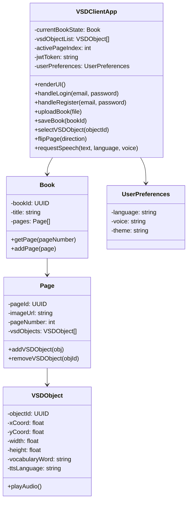
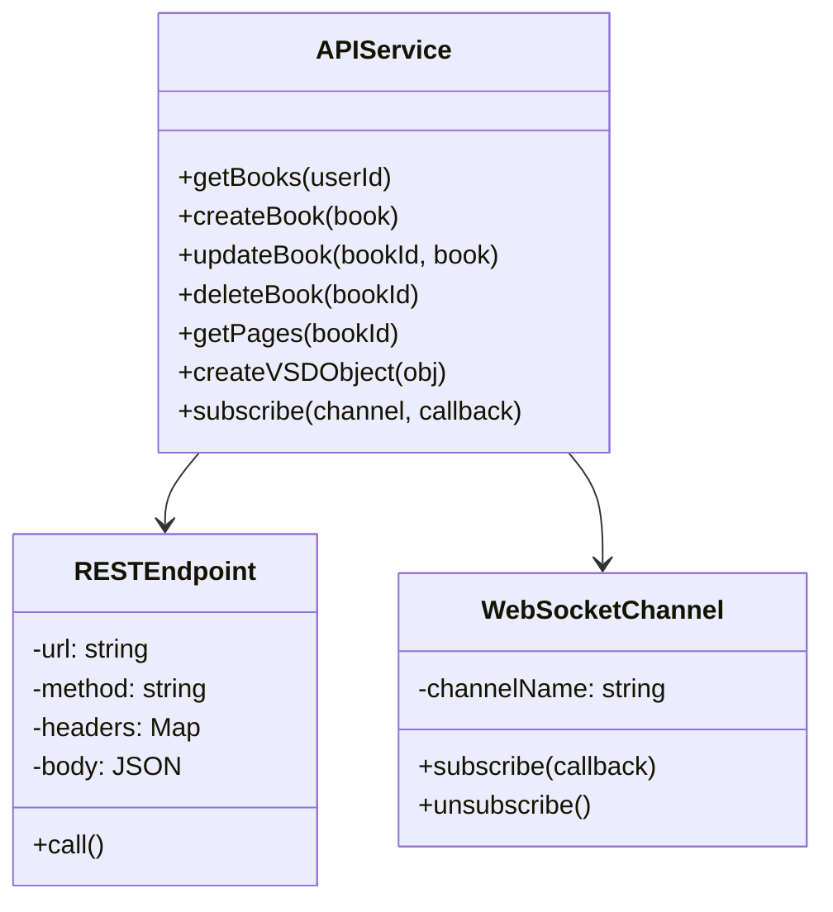
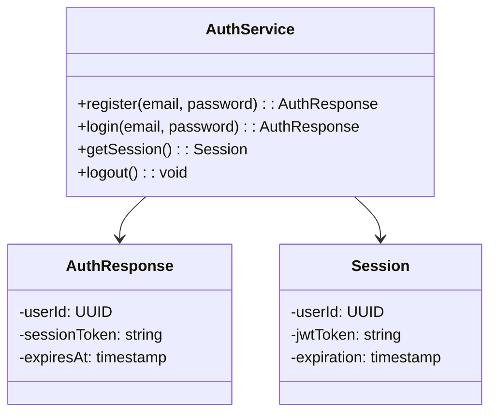
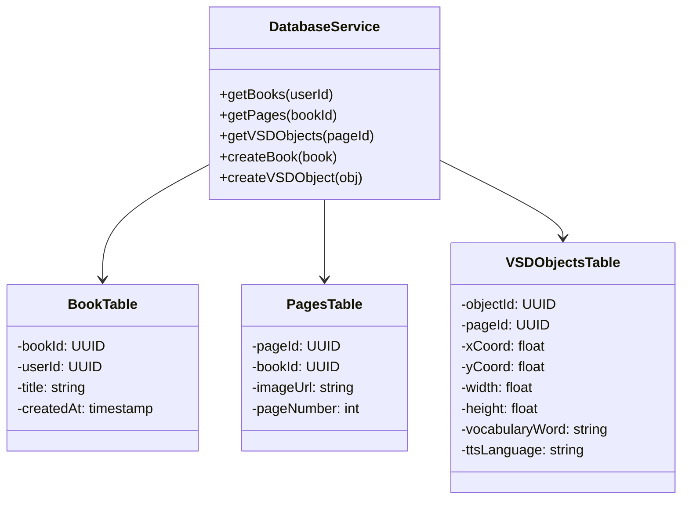
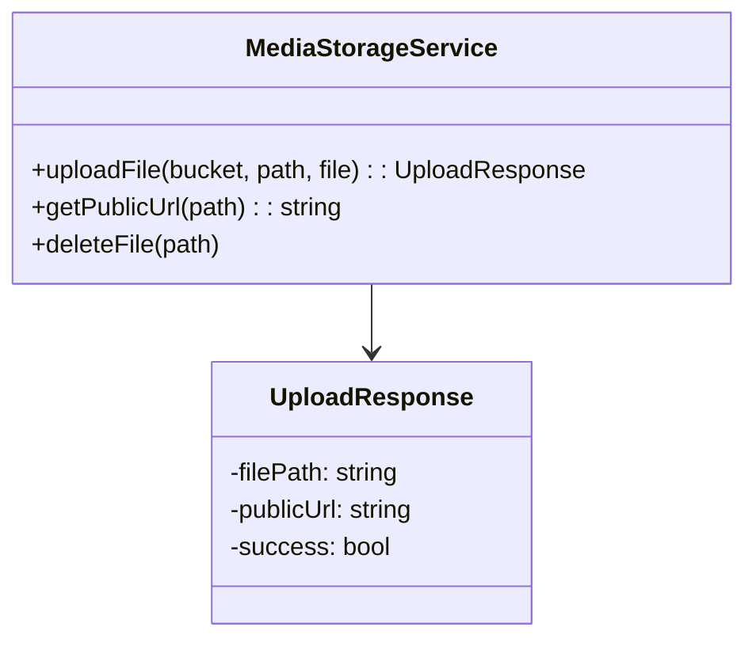
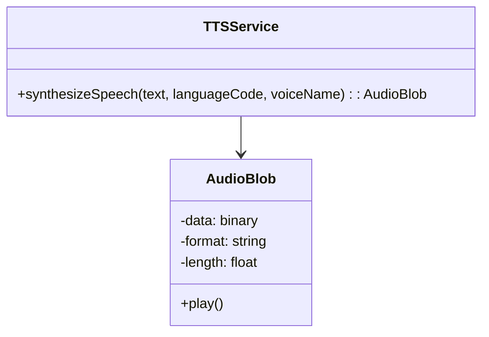

## Components and their interfaces

---

### VSD Client Application
- Web Application - React based front end
- Description: Browser based progressive web app (pwa) built using React, HTML, CSS, and JavaScript. This works in the user's browser using HTTPS to communicate with backend services. The user interface allows for loading storybooks, VSD editing through the HTML Canvas API, managing application state, and working with backend services.
- Responsibilities: Rendering UI components (library, editor, reader), manage application state (books, session, annotations), log user actions (clicks, page navigation), trigger API calls (auth, TTS), play audio, and maintain session tokens locally.
- Dependencies: Supabase REST API (HTTPS), Supabase realtime (WebSocket), Supabase Auth, Media storage URLs, external text-to-speech API, and browser APIs (canvas, audio, LocalStorage).

Interfaces

1. User interaction interface (UI Layer)
- Event-driven interface
```json
onLogin(email: string, password: string): void
onRegister(email: string, password: string): void
onUploadBook(file: File): void
onSaveBook(bookId: UUID): void
onSelectVSDObject(objectId: UUID): void
onPageFlip(direction: "next" | "previous"): void
```
2. REST communication interface (HTTPS)
- Protocol: HTTPS
- Data Format: JSON
- Authentication: JWT in Authorization header
```json
POST /rest/v1/books
Headers:
  Authorization: Bearer <JWT>
  Content-Type: application/json

Body:
{
  "title": "Brown Bear",
  "user_id": "uuid"
}
```
```json
{
  "book_id": "uuid",
  "created_at": "timestamp"
}
```
3. Realtime interface (WebSocket)
- Protocol: WebSocket
- Used for: Session sync
```json
subscribe(channel: string): void
unsubscribe(channel: string): void
```
4. TTS Interface
```json
requestSpeech(
    text: string,
    language: string,
    voice: string
): Promise<AudioStream>
```
returns audio

- Internally managed data: CurrentBookState, VSDObjectList[], ActivePageIndex, JWT token, and UserPreferences.



---

### Application API Layer - Supabase Rest and Realtime
- Application API layer
- Backend-as-a-service (Supabase Rest and Realtime)
- Description: The midway between the client and services. Exposes endpoints for operations while providing real-time synchronization using WebSockets. This enforces row-level security and validates authentication access.
- Responsibilities: Accept client requests, enforce authentication policies, route requests to PostgreSQL, publish realtime events, and validate permissions.
- Dependencies: PostgreSQL Database, Authentication service, and Supabase storage.

Interface

REST Endpoints

Protocol: HTTPS

Data format: JSON
- `GET /books` retrieve user books
- `POST /books` create new book
- `PUT /books/{id}` update book
- `DELETE /books/{id}` delete book
- `GET /pages?book_id=eq.uuid` get pages
- `POST /vsd_objects` create annotation
Protocol: WebSocket
```json
channel("book-updates")
  .on("postgres_changes", callback)
```
For live session updates




---

### Authentication Service
- Managed identity service (Supabase Auth)
- Description: Manages user identity, password encryption, and login sessions. This allows secure access to protected resources with token-based authentication.
- Responsibilities: User registration, login validation, password hashing, and session expiration.
- Dependencies: PostgreSQL (users table)

Interface

- Registration, returns user and session
```json
register(
  email: string,
  password: string
): Promise<AuthResponse>
```
- Login
```json
login(
  email: string,
  password: string
): Promise<AuthResponse>
```
- Session retrieval
```json
getSession(): Session | null
```
- Logout
```json
logout(): void
```

- Security protocol: HTTPS required, Row-Level Security (RLS) in database




---

### Storybook Data Service - Database
- Relational database (PostgreSQL)
- Description: Stores books, pages, annotations, and words as structured data. Enforces access policies through foreign keys and row-level security.
- Responsibilities: persistent storage, data relationships, query filtering, and ownership enforcement.

Interface

Books table
```json
book_id UUID PRIMARY KEY
user_id UUID REFERENCES users(id)
title TEXT
created_at TIMESTAMP
```

Pages table
```json
page_id UUID PRIMARY KEY
book_id UUID REFERENCES books(book_id)
image_url TEXT
page_number INTEGER
```

VSD objects table
```json
object_id UUID PRIMARY KEY
page_id UUID REFERENCES pages(page_id)
x_coord FLOAT
y_coord FLOAT
width FLOAT
height FLOAT
vocabulary_word TEXT
tts_language TEXT
```

Access interface
```json
GET /rest/v1/vsd_objects?page_id=eq.uuid
POST /rest/v1/vsd_objects
```



---

### Media Storage Service
- Object storage (Supabase storage bucket)
- Description: Stores uploaded storybook images and audio files and provides secure URL retrieval.
- Responsibilities: file upload, file retrieval, permission enforcement, and URL generation

Interface

Upload
```json
uploadFile(
  bucket: string,
  path: string,
  file: File
): Promise<UploadResponse>
```

Retrieve
```json
getPublicUrl(path: string): string
```

Delete
```json
deleteFile(path: string): void
```



---

### Text-To-Speech Service - External API
- External cloud API
- Description: Converts the selected work into audio, using an external speech service. 
- Responsibilities: Text normalization, language selection, voice generation, and audio waveform output.

Interface

Speech Request
```json
synthesizeSpeech(
  text: string,
  languageCode: string,
  voiceName: string
): Promise<AudioBlob>
```
Data Exchange
- Input: plain text, language code, voice ID
- Output: audio



---

### Interfaces together
Work flow
 - Client receives click
 - Client retrieves word
 - Client calls TTS interface
 - TTS returns audio
 - Client plays audio
 - API layer stores log in database

This system has loosely coupled services, standard protocols, secure authentication, scalable backned, and replaceable TTS. 

---
