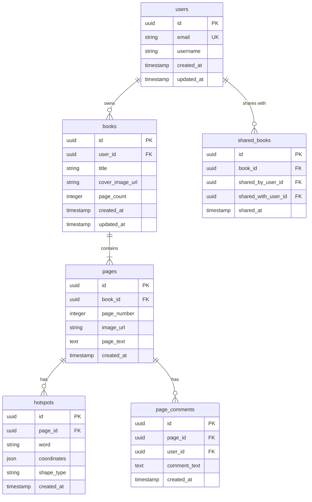

# Database Design

We're using PostgreSQL through Supabase to handle all our data storage needs - user accounts, books, pages, hotspots, and comments.

---

## Entity-Relationship Diagram



---

## Tables

### users

This table holds basic user account info. Supabase Auth handles most of this automatically.

| Column | Type | Constraints | Description |
|--------|------|-------------|-------------|
| `id` | UUID | PRIMARY KEY | Unique user ID |
| `email` | VARCHAR(255) | UNIQUE, NOT NULL | Email address |
| `username` | VARCHAR(100) | NOT NULL | Display name |
| `created_at` | TIMESTAMP | DEFAULT NOW() | When account was created |
| `updated_at` | TIMESTAMP | DEFAULT NOW() | Last update |

**Indexes:** Primary key on `id`, unique on `email`

---

### books

Each uploaded storybook gets a record here.

| Column | Type | Constraints | Description |
|--------|------|-------------|-------------|
| `id` | UUID | PRIMARY KEY | Unique book ID |
| `user_id` | UUID | FOREIGN KEY, NOT NULL | Who owns this book |
| `title` | VARCHAR(255) | NOT NULL | Book title |
| `cover_image_url` | TEXT | | Cover image location in storage |
| `page_count` | INTEGER | DEFAULT 0 | How many pages |
| `created_at` | TIMESTAMP | DEFAULT NOW() | When uploaded |
| `updated_at` | TIMESTAMP | DEFAULT NOW() | Last edited |

**Indexes:** Primary key on `id`, index on `user_id` for faster library lookups

**Relationships:** Links to users table. If user is deleted, their books are deleted too (CASCADE).

---

### pages

Individual pages within a book.

| Column | Type | Constraints | Description |
|--------|------|-------------|-------------|
| `id` | UUID | PRIMARY KEY | Unique page ID |
| `book_id` | UUID | FOREIGN KEY, NOT NULL | Which book this belongs to |
| `page_number` | INTEGER | NOT NULL | Page order (starts at 1) |
| `image_url` | TEXT | NOT NULL | Image location in storage |
| `page_text` | TEXT | | Text content (optional) |
| `created_at` | TIMESTAMP | DEFAULT NOW() | When created |

**Indexes:** Primary key on `id`, composite on `(book_id, page_number)` for efficient page loading

**Relationships:** Links to books table. Pages are deleted if their book is deleted.

**Constraint:** Can't have duplicate page numbers in the same book.

---

### hotspots

Interactive regions on pages that speak words when clicked.

| Column | Type | Constraints | Description |
|--------|------|-------------|-------------|
| `id` | UUID | PRIMARY KEY | Unique hotspot ID |
| `page_id` | UUID | FOREIGN KEY, NOT NULL | Which page this is on |
| `word` | VARCHAR(255) | NOT NULL | Word to speak via TTS |
| `coordinates` | JSONB | NOT NULL | Where the hotspot is drawn |
| `shape_type` | VARCHAR(50) | DEFAULT 'rectangle' | rectangle, circle, or polygon |
| `created_at` | TIMESTAMP | DEFAULT NOW() | When created |

**Indexes:** Primary key on `id`, index on `page_id`

**Relationships:** Links to pages table. Deleted when page is deleted.

**Coordinates format:**

Rectangle:
```json
{"x": 100, "y": 150, "width": 200, "height": 150}
```

Circle:
```json
{"x": 200, "y": 200, "radius": 50}
```

Polygon:
```json
{"points": [{"x": 10, "y": 20}, {"x": 30, "y": 40}, {"x": 15, "y": 60}]}
```

---

### page_comments

Caretakers can leave notes on pages for themselves or other editors.

| Column | Type | Constraints | Description |
|--------|------|-------------|-------------|
| `id` | UUID | PRIMARY KEY | Unique comment ID |
| `page_id` | UUID | FOREIGN KEY, NOT NULL | Which page |
| `user_id` | UUID | FOREIGN KEY, NOT NULL | Who wrote it |
| `comment_text` | TEXT | NOT NULL | The comment |
| `created_at` | TIMESTAMP | DEFAULT NOW() | When posted |

**Indexes:** Primary key on `id`, index on `page_id`

**Relationships:** Links to both pages and users. Deleted if page or user is deleted.

---

### shared_books

Tracks when users share books with each other.

| Column | Type | Constraints | Description |
|--------|------|-------------|-------------|
| `id` | UUID | PRIMARY KEY | Unique share record ID |
| `book_id` | UUID | FOREIGN KEY, NOT NULL | Which book |
| `shared_by_user_id` | UUID | FOREIGN KEY, NOT NULL | Who shared it |
| `shared_with_user_id` | UUID | FOREIGN KEY, NOT NULL | Who received it |
| `shared_at` | TIMESTAMP | DEFAULT NOW() | When shared |

**Indexes:** Primary key on `id`, index on `shared_with_user_id` for finding books shared with you

**Relationships:** Links to books and users. Deleted if book is deleted.

**Constraint:** Can't share the same book to the same person twice.

---

## File Storage

We're using Supabase Storage buckets to store uploaded files.

### book-images

Page images live here.

- **Path:** `{user_id}/{book_id}/{page_number}.png`
- **Privacy:** Only accessible to book owner or users the book is shared with
- **Allowed:** PNG, JPG, JPEG files
- **Size limit:** 10 MB per image

---

## Security

We're using Supabase Row Level Security (RLS) to control who can access what.

**Books**
- You can only see and edit your own books
- You can view books shared with you (but not edit them)
- You can share your books with others

**Pages, Hotspots, Comments**
- Access follows book permissions
- You can only edit these for books you own
- You can view them for shared books

**Shared Books**
- You can share your own books
- You can see what's been shared with you

---

## How Things Connect

- Users own books
- Books have multiple pages (sorted by page number)
- Pages can have multiple hotspots
- Pages can have multiple comments
- Books can be shared with multiple users
- Everything cascades - delete a book and all its pages/hotspots go with it

---

## How It Works in Practice

**When someone creates a book:**
1. They upload images (saved to `book-images` bucket)
2. A book record gets created
3. A page record is created for each image
4. They can now add hotspots in edit mode

**When someone adds a hotspot:**
1. They draw a shape on the page in the Canvas editor
2. They type in a word
3. We save the hotspot with its coordinates and word
4. In reading mode, clicking that area speaks the word using Web Speech API

**When someone reads a book:**
1. They pick a book from their library
2. We load the book and its pages
3. We load the hotspots for each page
4. When they click a hotspot, we pass the word to TTS

**When someone shares a book:**
1. Owner adds a share record linking the book to another user
2. That user can now see the book in their library
3. They can read it but can't edit it

---

## Future Ideas

Things we might add later:

- Analytics table to track which hotspots get clicked most
- Templates for common VSD layouts
- User preferences (favorite TTS voice, language settings)
- Tags or categories for organizing books
- Favorites/bookmarks
