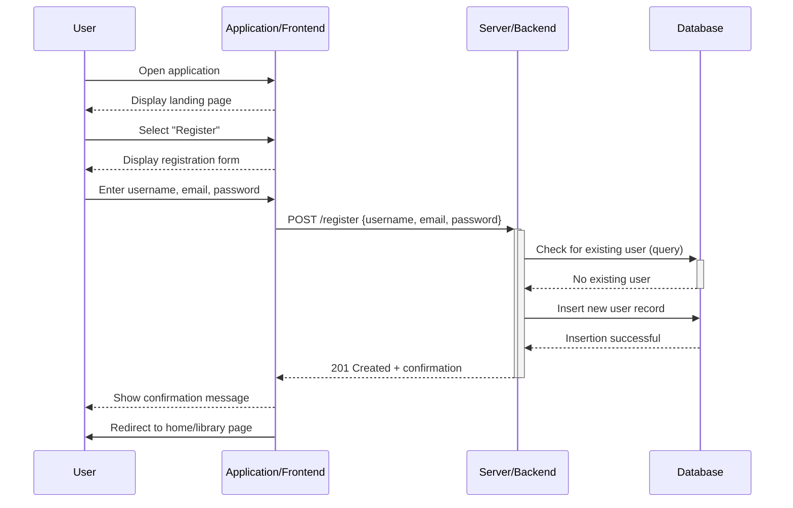
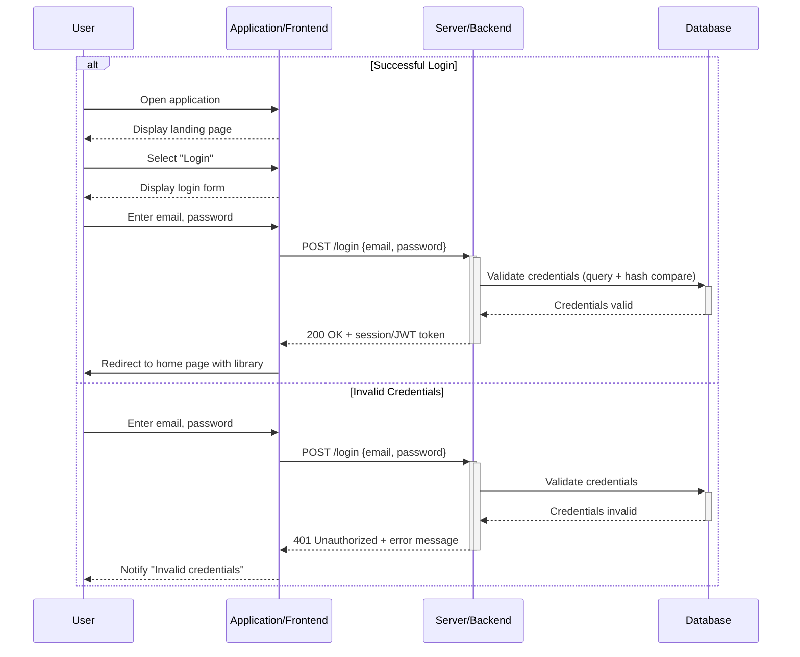
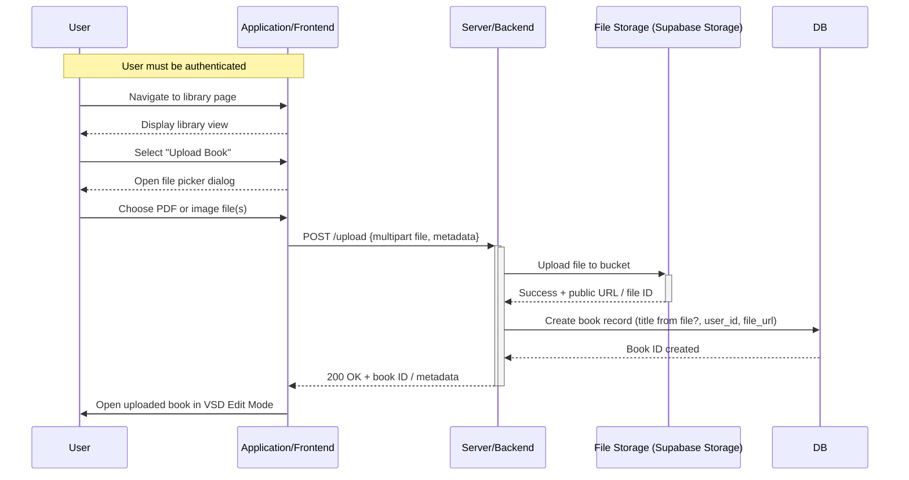

# Use Case Diagrams

Sequence diagrams showing the data flow for all use cases. One sequence diagram corresponds to one use case and different use cases should have different corresponding sequence diagrams.

---

## Use Case 1 – Account Creation (User / Caretaker)

**Goal**: As a user, I want to create an account so I can save and manage my storybooks.

---
## Use Case 2 – Signing In (User / Caretaker)

**Goal**: As a user, I want to log into my account so I can access my saved storybooks.

---
## Use Case 3 – Uploading Book (User / Caretaker)

**Goal**: As a user, I want to upload a book so I can create a VSD storybook.

---
